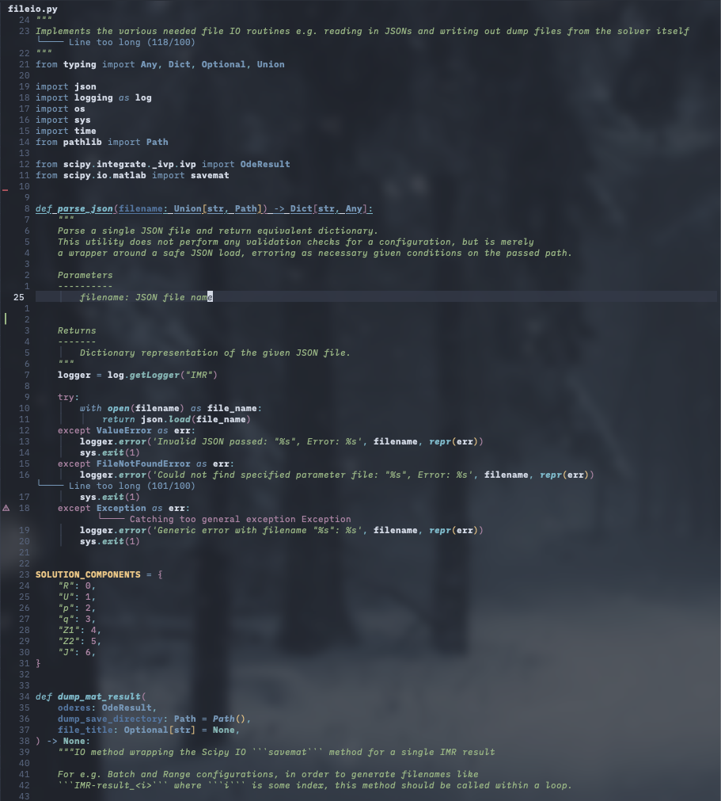

# Endgame.nvim

My pretty-much-endgame neovim setup, an extension/ edit/ fork of [shaunsingh/nyoom.nvim](https://www.github.com/shaunsingh/nyoom.nvim).
It was slightly more involved before the modularization update.

Note that you'll need `nvim 0.8.0` ie nightly, as of writing; addt., I use iTerm2's transparency feature, so my background is truly
transparent. `nvim-notify` warns you; have not yet found a work around.

